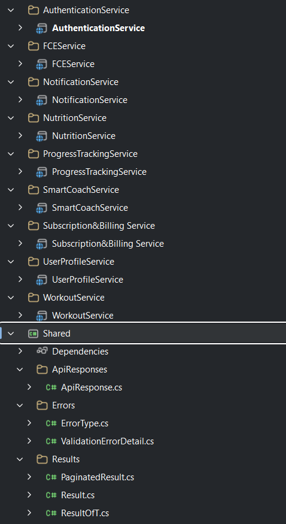

# FitnessApp Backend

 Please read this quick guide to understand how we structure our code and work together.

---

## 📁 Project Structure

As you can see in our solution Project Structure Image , each microservice has its own **Solution Folder** (for example: `AuthenticationService`, `WorkoutService`, `NutritionService`).

### 🛠️  (Choose Your Architecture)
 You can choose the internal architecture that best fits your needs:

1. **Simple Service:** If your service only does simple database operations (CRUD), you can keep it simple with just **1 Web API project** inside your service folder.
2. **Complex Service (Clean Architecture):** If your service has complex business rules, you can split it into **4 separate projects** inside your service folder:
   * `{ServiceName}.Api` (Controllers, Presentation)
   * `{ServiceName}.Application` (Use cases, features, business logic)
   * `{ServiceName}.Infrastructure` (Database access, external APIs, queues)
   * `{ServiceName}.Domain` (Core entities and exceptions)

---

## 📦 The Shared Project

This is a common class library that **every microservice can reference**. It holds common utilities so we don't write the same code twice. Right now, it contains:
* **ApiResponses:** Standard structure for all API outputs (`ApiResponse.cs`).
* **Errors:** Common error types and validation details.
* **Results:** The Result Pattern files (`Result.cs`, `ResultOfT.cs`, `PaginatedResult.cs`) to handle success and failure smoothly without throwing messy exceptions.

###  The Golden Rule for the Shared Project:
**Do NOT put any database models, business logic, or service-specific code here.** 

---

##  What's Next?
 we will add an **API Gateway** project to sit in front of all these services and handle the incoming routing automatically. 

